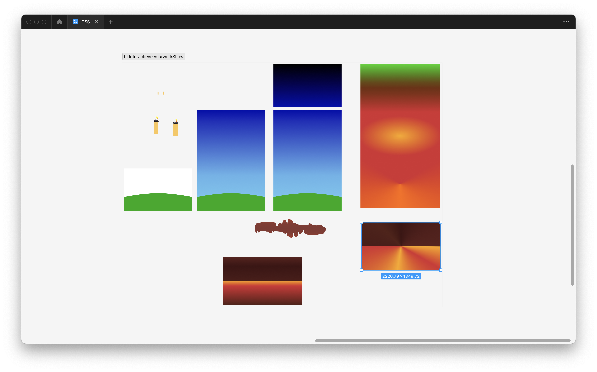

### CSS To The Rescue
> 
####  Contents  
- [Assignment](#assignment)
  - [Leerdoelen](#leerdoelen)
  - [Rubic](#rubic)
- [Process](#process)
  - [Mijn plan](#mijn-plan)
    - [Assets](#assets)
    - [Font Variable Animation](#font-variable-animation)
    - [Fireworkception](#fireworkception)
  - [Voortgang](#voortgang)
    - [`@media (prefers-color-scheme)`](#media-prefers-color-scheme)
    - [`@media (width < width)`](#media-width--width)
  - [Afronding](#afronding)
- [Bronnen](#bronnen)
  
## Assignment
 ### Leerdoelen  
   - Je kunt experimenteren met (voor jou) **nieuwe css-technieken** - om de mogelijkheden op waarde te schatten en te gebruiken waar gepast.
   - Je hebt begrip van de volle kracht en mogelijkheden van CSS. Je laat zien dat CSS meer kan dan allen web pages 'stylen'.
   - Je hebt begrip van de interactie-technieken van CSS (en HTML). De UX is aangenaam bruikbaar binnen de gekozen context(en).
   - Je hebt begrip hoe progressive enhancement elegant toe te passen. Je laat zien dat je cascade, inheritance en specificity kunt toepassen.
### Rubic
   - [x] Je hebt **geëxperimenteerd** met voor jou nieuwe CSS-technieken.
   - [ ] Je resultaat is een experimentele én aangename ervaring waarbij **inhoud, vorm en interactie** één geheel vormen.
   - [ ] Je laat zien dat je de **mogelijkheden en kracht van CSS begrijpt.** In je code gebruik je CSS, HTML waar ze in uitblinken en combineer je de technieken zodat ze elkaar versterken.
   - [x] Je code bestaat uit **vanilla CSS** en HTML. Geen JS, pre-processors, libraries en frameworks en alleen ID’s en classes indien strikt noodzakelijk.
   - [ ] **Proces:**
      - [x] Je website staat tijdig online (op GitHub en DLO) en is zonder technische problemen te zien. Verwijzingen naar bestanden (css, js, afbeeldingen, fonts, etc.) werken. Je website werkt in minimaal één browser naar keuze.
      - [x] Je code is verzorgd en leesbaar. Netjes ingesprongen, van commentaar voorzien, etc.
      - [x] Je vermeldt gebruikte bronnen in je code en procesverslag.
      - [x] Je hebt je vorderingen besproken en je proces vastgelegd en tijdig ontsloten op GitHub.
   - [ ] Je kunt je **code uitleggen** in het eindgesprek.

## Process

### Mijn plan

De CSS technieken waar ik mee ga beginnen
- `animation`
- `@keyframes`
- `transforms`
- `background-position`
- `font-variable`
- `@media preferes-color-scheme`

#### Assets



#### Font Variable Animation

.png)

```javascript
h1 {
  font-size: 5vw;
  font-variation-settings: 'XROT' 30, 'YROT' 30;
  background-size: auto auto;
  background-clip: border-box;
  background-size: 200% auto;
  background-clip: text;
  text-fill-color: transparent;
  -webkit-background-clip: text;
  -webkit-text-fill-color: transparent;
  animation: FontVars 10s infinite linear both;
  transform: translateZ(-1px) scale(2.2);
}
```

.png)

```javascript
@media (prefers-reduced-motion: reduce) {
  h1 {
    animation: FontVars 5s infinite linear both;
  }
}

@media (prefers-color-scheme: dark) {
  h1 {
    background-image: radial-gradient(circle,
        #231557 0%,
        #44107a 29%,
        #ff1361 67%,
        #fff800 100%);
    animation: textclip 2s linear infinite;
  }
}

@keyframes textclip {
  to {
    background-position: 200% center;
  }
}

@keyframes FontVars {
  0% {
    font-variation-settings: 'XROT' -40, 'YROT' 1;
	}
  25% {
    font-variation-settings: 'XROT' 10, 'YROT' -40;
	}
  50% {
    font-variation-settings: 'XROT' 40, 'YROT' 40;
	}
  75% {
    font-variation-settings: 'XROT' 10, 'YROT' -40;
	}
  100% {
    font-variation-settings: 'XROT' -40, 'YROT' 1;
	}
}
```
#### Fireworkception


### Voortgang

#### `@media (prefers-color-scheme)`


#### `@media (width < width)`

.png)


Het positioneren van sommmige elementen ging lastig, en was anders in verschillende browsers. Dit is uiteindelijk opgelost door op het parent element ook een positioning te geven

met target selector to scroll geprobeert om parralax elementen toe te voegen, maar dit is helaas niet gelukt.

Feedback

Iets meer beweging, en css

### Afronding


 


## Bronnen  
- [CSS-Only Responsive Layout with Smooth Transitions | Codrops](https://tympanus.net/codrops/2012/06/12/css-only-responsive-layout-with-smooth-transitions/)  
- [Using CSS animations - CSS: Cascading Style Sheets | MDN](https://developer.mozilla.org/en-US/docs/Web/CSS/CSS_Animations/Using_CSS_animations)  
- [text-color-animation](https://codepen.io/alvarotrigo/pen/PoKMyNO)  
- [Eindopdracht - CSS to the Rescue 22/23](https://cmda-minor-web.github.io/css-to-the-rescue-2223/index.html#vuurwerkshow)  
- [Font scaling based on size of container](https://stackoverflow.com/questions/16056591/font-scaling-based-on-size-of-container)

